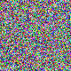
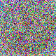
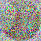
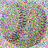
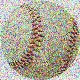

# Adversarial image perturbation with evolutionary algorithms 

Predicting images from  ILSVRC dataset using AlexNet. Then recreating the correctly classified image(s) using NiaPy's evolutionary algorithms, trying to recreate it as similiar to original as possible, but only to the point, that AlexNet fails its prediction.

### Evolution progress

        

## Learning phase
**The algorithm recreates the whole original picture from scratch considering only the BenchMark function.** No compression or simplification of the image were used. I believe, this approach will lead us into the direction, where we can apply the procedure on **any image** of any size, that AlexNet recognizes in the first place. The future goal is to work on the AlexNet's native 224*224 resolution.

## Dataset

Link to the dataset: [ImageNet](http://www.image-net.org/challenges/LSVRC/2010/index)

Thanks to [Article: ImageNet Large Scale Visual Recognition Challenge](https://arxiv.org/abs/1409.0575)

How to cite:
```
@article{ILSVRC15,
Author = {Olga Russakovsky and Jia Deng and Hao Su and Jonathan Krause and Sanjeev Satheesh and Sean Ma and Zhiheng Huang and Andrej Karpathy and Aditya Khosla and Michael Bernstein and Alexander C. Berg and Li Fei-Fei},
Title = {{ImageNet Large Scale Visual Recognition Challenge}},
Year = {2015},
journal   = {International Journal of Computer Vision (IJCV)},
doi = {10.1007/s11263-015-0816-y},
volume={115},
number={3},
pages={211-252}
}

```

## Requirements
* Python 3.6+
* Jupyter Notebook environment
* Pip
* NiaPy 2.0.0rc12
* [GARI](https://github.com/ahmedfgad/GARI) - Genetic Algorithm for Reproducing Images

#### 2 versions

Code is in early stage, some paths etc. are still hardcoded. Images used for CNN are on my GoogleDrive, therefore there can be a problem accessing them. Because of that, there are currently 3 versions of Jupyter Notebook:
* "AlexNetDiplomskaColab.ipynb" that requires Colab, my gDrive etc. - *Full version!*
* "NiaPyDiplomska.ipynb" that uses 1 picture (tiger.jpg), NiaPy and CNN prediction in Google Colab. *Important! Download files!*

### Milestones
* Added **PyGad & Gari** to create a **Proof Of Concept**, proving that the idea and BenchMark works
* **Succesfully recreated** a few images. We can nicely see which pixels have been tampered with, to achieve almost **100% wrong prediction of AlexNet**
* **Added Metrics** to compare and evaluate images after recreation

   

## Succesfully recreated images

First No. represents the border, at which we, if AlexNet recognizes the actual motive of the picture, include it into the BenchMark. This forces evolutional algorithm to recreate a picture not only similiar to the original, but also in such way that **AlexNet completely fails** at its prediction

### Examples

* Recreated Baseball at 20k-32,5k: 

 

* Recreated Nautilus with updated/fixed BenchMark at 50k-52,5k: 

 


## License

Copyright © 2021 [KukovecRok](https://github.com/KukovecRok). <br /> 
This project is MIT licensed.
